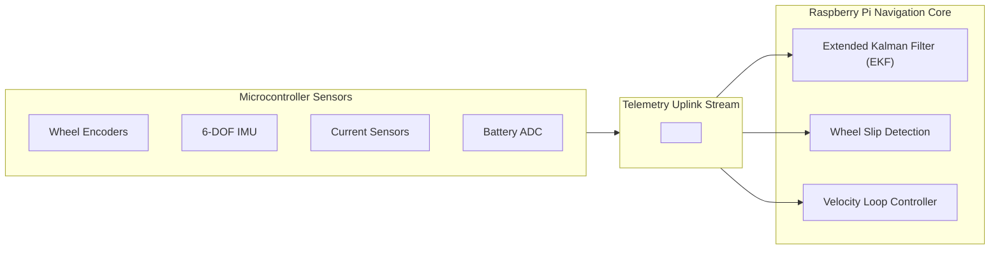

# Autonomous Agri-Rover: Serial Communication & Telemetry Specification

**Document Version:** 1.0.0  
**Target Architecture:** Raspberry Pi 3B / PC (Host Brain) $\leftrightarrow$ ESP32 / Arduino (Low-Level Actuator & Sensor Node)  
**Standard Baud Rate:** 115,200 bps (8N1)

---

## 1. Executive Summary

This document specifies the communication protocol and telemetry data structures used by the autonomous agricultural rover. The architecture splits responsibilities between:

1. **High-Level Computer (Raspberry Pi 3B / Companion PC)**:
   * Vision processing (crop row / line detection).
   * Path planning and navigation decisions.
   * Web telemetry cockpit & user interaction.
2. **Low-Level Microcontroller (ESP32 / Arduino)**:
   * High-frequency motor PWM actuation (20 kHz ultrasonic on ESP32).
   * Slew-rate acceleration and deceleration ramping.
   * Real-time hardware watchdog and failsafe monitoring.
   * Sensor aggregation (wheel odometry, battery voltage, current sensing).

---

## 2. Physical & Data Link Layer

```
┌─────────────────────────────────┐                 ┌─────────────────────────────────┐
│        Raspberry Pi 3B          │                 │        ESP32 Controller         │
│                                 │                 │                                 │
│  /dev/ttyUSB0 or /dev/ttyACM0   │◄── USB-UART ───►│  UART0 (GPIO 1 TX / GPIO 3 RX)  │
│  115,200 Baud, 8N1              │   (115.2 kbps)  │  115,200 Baud, 8N1              │
└─────────────────────────────────┘                 └─────────────────────────────────┘
```

| Parameter | Value | Description |
| :--- | :--- | :--- |
| **Baud Rate** | `115200` | High throughput with low latency; well within standard USB-UART tolerances. |
| **Data Bits** | `8` | Standard 8-bit byte. |
| **Parity** | `None` | No hardware parity bit. |
| **Stop Bits** | `1` | 1 stop bit (8N1). |
| **Flow Control** | `None` | Software packet framing replaces hardware RTS/CTS. |
| **Packet Delimiters** | `<` and `>` | ASCII `0x3C` (`<`) begins packet; ASCII `0x3E` (`>`) terminates packet. |
| **Line Termination** | `\n` | Optional newline for stream flushing and serial monitor readability. |

---

## 3. Protocol Framing & Parser State Machine

Every packet transmitted across the serial link follows strict framing delimiters:
```text
<PAYLOAD>
```

### Parser Finite State Machine (FSM)

```
        ┌─────────────┐
        │  WAIT_START │◄────────────────────────┐
        └──────┬──────┘                         │
               │ Received '<'                   │
               ▼                                │
        ┌─────────────┐   Buffer Overflow       │
        │ IN_PAYLOAD  ├─────────────────────────┤
        └──────┬──────┘   or Malformed Byte     │
               │                                │
               │ Received '>'                   │
               ▼                                │
        ┌─────────────┐                         │
        │ PACKET_EXEC ├─────────────────────────┘
        └─────────────┘
```

* **Delimiter Isolation**: Any characters outside `<` and `>` are discarded. This guarantees that noise or mid-stream connections do not desynchronize the parser.
* **Maximum Packet Length**: 64 bytes. If the buffer exceeds 64 bytes without an end delimiter `>`, the buffer resets to `WAIT_START`.

---

## 4. Downlink Protocol: Master Commands (Raspberry Pi $\rightarrow$ ESP32)

Commands transmitted from the Raspberry Pi down to the microcontroller to drive the rover and manage safety states.

### Command Reference Table

| Packet Command | Arguments / Payload | Functional Description | Motor Driver Behavior |
| :--- | :--- | :--- | :--- |
| `<TRACKING_DISABLED>` | *None* | Disarms drive system into Standby. | Target & current PWM set to `0`. Motor outputs disabled. Armed LED OFF. |
| `<TRACKING_ENABLED>` | *None* | Arms drive system for motion. | Enables slew-rate ramps. Prepares H-bridge drivers. Armed LED ON. |
| `<EMERGENCY_STOP>` | *None* | Immediate emergency shutdown. | Instantly cuts all PWM to `0` with zero ramp delay. Locks system until explicitly re-enabled. |
| `<left_pwm,right_pwm>` | `left`: $[-255 \dots +255]$<br>`right`: $[-255 \dots +255]$ | Differential drive motor speed vector. | Feeds target velocities to the internal slew-rate acceleration limiter. |

### Drive Vector Details

```
              ▲ FORWARD (+PWM)
              │
   Left Wheel │  Right Wheel
      [+]     │     [+]
              │
◄─────────────┼─────────────►
TURN LEFT     │    TURN RIGHT
              │
      [-]     │     [-]
              │
              ▼ REVERSE (-PWM)
```

* **Straight Cruise**: `<150,150>` (Both motors drive forward at ~58% duty cycle).
* **Reverse**: `<-120,-120>` (Both motors drive reverse).
* **Differential Turn**: `<170,90>` (Left wheel spins faster; rover curves smoothly to the right).
* **Pivot Turn (Skid Steer)**: `<140,-140>` (Left wheel forward, right wheel reverse; rotates in place).
* **Stop**: `<0,0>` (Decelerates smoothly to 0 PWM).

---

## 5. Uplink Protocol: Telemetry & Status (ESP32 $\rightarrow$ Raspberry Pi)

Telemetry broadcast from the microcontroller to the Raspberry Pi for cockpit display, automated logging, and system health checks.

### 5.1 System State & Handshake Packets

| Packet | Description | When Transmitted |
| :--- | :--- | :--- |
| `<STATUS:READY,BAT=12.4V,ARMED=0>` | Bootup diagnostic and self-test verification. | Sent once upon microcontroller boot or reset. |
| `<STATE:ARMED>` | Acknowledgment that motor drivers are active. | Sent immediately when `<TRACKING_ENABLED>` is accepted. |
| `<STATE:DISARMED>` | Acknowledgment that motor drivers are disabled. | Sent immediately when `<TRACKING_DISABLED>` is accepted. |

### 5.2 Periodic Sensor Telemetry (10 Hz Stream)

Transmitted every **100 ms** (`10 Hz`) during operation:

```text
<TELE:BAT=12.38V,L_ENC=1420,R_ENC=1405,PWM_L=150,PWM_R=150>
```

#### Field Breakdown:
1. **`BAT=<volts>V`**:
   * Scaled voltage reading from the hardware resistor divider connected to an analog pin (e.g., ESP32 `GPIO 34`).
   * Used by the Raspberry Pi Cockpit to trigger low-battery alarms (e.g., $< 10.8\text{V}$ for a 3S LiPo).
2. **`L_ENC=<signed_integer>`**:
   * Cumulative pulse count from the left wheel optical or Hall-effect encoder.
3. **`R_ENC=<signed_integer>`**:
   * Cumulative pulse count from the right wheel encoder.
4. **`PWM_L=<integer>` & `PWM_R=<integer>`**:
   * The instantaneous, slew-rate limited PWM value currently being applied to the motor drivers (useful to inspect acceleration curves).

### 5.3 Hardware Fault & Safety Alerts

| Packet | Trigger Condition | Automated Pi Response |
| :--- | :--- | :--- |
| `<WARN:WATCHDOG_STOP>` | No valid serial command received for $> 500\text{ ms}$. | Displays communication timeout warning on the web UI. |
| `<ERR:LOW_BAT>` | Measured voltage dropped below safe discharge threshold. | Triggers audible/visual alarm; initiates graceful shutdown. |
| `<ERR:OVERCURRENT>` | Driver flag or shunt resistor detected a motor stall. | Alerts operator that tracks/wheels are mechanically trapped. |

---

## 6. Next-Generation Telemetry Extensions

For future autonomous development, the telemetry framework is designed to support the following advanced capabilities:



### 6.1 Wheel Odometry & Distance Calculation
By converting pulse increments into linear travel distance:
$$\Delta D = \frac{(\Delta \text{Ticks}_L + \Delta \text{Ticks}_R)}{2} \times \left( \frac{\pi \times D_{\text{wheel}}}{\text{CPR}} \right)$$

* $D_{\text{wheel}}$: Diameter of the drive wheels (meters).
* $\text{CPR}$: Encoder counts per wheel revolution.
* Allows the Raspberry Pi to track row traversal distance without GPS.

### 6.2 Visual-Inertial Wheel Slip Detection
* The Raspberry Pi measures forward velocity $V_{\text{visual}}$ by tracking ground features with the camera.
* The ESP32 reports encoder speed $V_{\text{encoder}}$.
* **Slip Metric:**
  $$\text{Slip Ratio} = \frac{V_{\text{encoder}} - V_{\text{visual}}}{V_{\text{encoder}}}$$
* If the slip ratio exceeds $40\%$, the rover detects it is digging into mud or loose soil, automatically reducing throttle and redistributing torque.

### 6.3 Transition from Raw PWM to Physical Velocity Control ($v, \omega$)
* **Current Mode (Baseline):** Pi calculates raw PWM scalar $[-255 \dots +255]$.
* **Next-Gen Mode:** Pi sends physical metric velocities:
  ```text
  <VEL:V=0.50,W=-0.15>
  ```
  *(Forward speed $V = 0.50\text{ m/s}$, Angular turning rate $W = -0.15\text{ rad/s}$)*.
* The ESP32's dual-core Xtensa processor executes an internal $100\text{ Hz}$ PID loop against encoder feedback to guarantee exact physical velocities regardless of field incline, soil drag, or battery sag.

---

## 7. Timing & Bandwidth Budget

| Operational Loop | Frequency | Interval | Bandwidth Impact |
| :--- | :--- | :--- | :--- |
| **Camera Vision & Steering Planner** | $25 - 30\text{ Hz}$ | $33 - 40\text{ ms}$ | ~600 bytes/sec (Downlink) |
| **Telemetry Uplink Broadcast** | $10\text{ Hz}$ | $100\text{ ms}$ | ~550 bytes/sec (Uplink) |
| **ESP32 Internal Slew Ramp** | $100\text{ Hz}$ | $10\text{ ms}$ | Internal CPU only (0 baud) |
| **Hardware Failsafe Watchdog** | Timeout at $500\text{ ms}$ | Continuous | Triggers shutdown if link drops |

At **115,200 baud** (effective throughput $\approx 11,520\text{ bytes/sec}$), the communication protocol consumes **$< 10\%$** of total serial bandwidth, leaving ample overhead and zero risk of buffer overflows on the Raspberry Pi.
